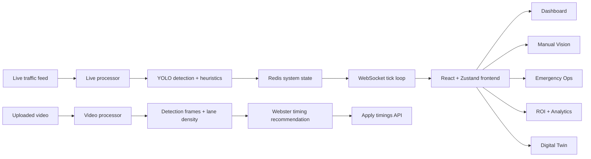

# UrbanMind

UrbanMind is a realtime urban traffic intelligence platform built for hackathon demos, operator-facing command workflows, and AI-assisted mobility storytelling. It combines adaptive signal control, YOLO-based vision analysis, emergency green-corridor automation, live multi-node footage, GPS-aware emergency tracking, congestion rerouting guidance, and responsive digital twin and admin experiences into one coordinated system.

## What It Does

- Syncs a 9-sector traffic network across dashboard, analytics, ROI, emergency operations, and digital twin views
- Runs YOLO-based vehicle detection on uploaded traffic footage through the Manual Vision module
- Generates on-page post-analysis reports with traffic mix, lane-density evidence, timing recommendations, and annotated frames
- Maintains a live vision telemetry stream for total vehicle detection and system-wide dashboard KPIs
- Auto-triggers Emergency Ops when ambulance, police, or fire vehicles are inferred from live detection
- Adds siren-aware escalation signals into the administrative log and emergency activation flow
- Tracks emergency units with live GPS trails, route status, congestion hotspots, and alternate-corridor recommendations
- Visualizes the city network in a responsive Digital Twin experience
- Includes responsive Settings, Manual Vision, Emergency Ops, ROI, and Digital Twin pages for presentation-ready demos

## Current Demo Scope

The seeded demo network contains 9 Delhi traffic sectors:

1. Connaught Place (CP) Outer Circle
2. ITO Junction (Vikas Marg)
3. AIIMS Crossing (Ring Road)
4. Hauz Khas Junction (August Kranti)
5. Lajpat Nagar (Moolchand Crossing)
6. Nehru Place Main Intersection
7. Karol Bagh (Pusa Road)
8. Dwarka Sector 10 Chowk
9. Rohini Sector 15 Crossing

## Product Modules

### Sector Dashboard

- Shared live KPIs
- AI Core Engine
- Sector deployment
- Administrative log
- Live footage autoplay

### All Footages

- 9 node-based live traffic feeds
- Responsive camera grid for multi-sector monitoring

### Manual Vision

- Upload traffic videos
- Run YOLO-based detection
- View a detailed analysis dossier on-page
- Review traffic mix, sampled lane density, confidence evidence, and recommended timings
- Apply computed signal timings back to the mapped sector

### Emergency Ops

- Manual dispatch for ambulance, fire, and police
- Vision-triggered and siren-confirmed corridor activation
- GPS route playback and corridor progress
- Congestion hotspot detection on the active corridor
- Alternate route and reroute recommendation when upcoming sectors are congested

### Settings

- Responsive admin configuration page
- Visualization, AI protocol, audit, and project-credit panels

### Traffic Analytics

- Realtime network metrics and visual summaries
- Wait-time and flow analytics

### Economic ROI

- Cost savings
- Time recovery
- carbon and efficiency projections synced to live traffic metrics

### 3D City Digital Twin

- Responsive spatial intelligence page
- Shared live telemetry rendered as a city-scale view

## Architecture Overview



## Manual Vision Workflow

1. Upload a traffic video from the Manual Vision page.
2. Map it to one of the 9 sectors.
3. Backend stores the file and launches background YOLO analysis.
4. Frontend polls analysis status and updates progress.
5. After completion, the page shows a detailed YOLO analysis dossier including:
   - total detections
   - processed frames
   - average confidence
   - estimated wait reduction
   - vehicle mix breakdown
   - lane density matrix
   - recommended signal timings
   - YOLO evidence frames
6. Operators can apply the recommended timings to the mapped intersection.

## Emergency Tracking Workflow

1. An emergency unit is dispatched manually or activated from live detection.
2. The backend assigns a primary corridor across the mapped sectors.
3. GPS position updates stream over the websocket to the frontend.
4. The emergency page renders live unit position, corridor progress, GPS trail history, and ETA.
5. Upcoming intersections are evaluated for congestion risk.
6. If the active corridor becomes congested, the system generates:
   - route status
   - congestion hotspots
   - reroute recommendation
   - alternate corridor intersections
7. The map overlays both the primary route and the alternate route for operators.

## Tech Stack

| Layer | Technologies |
|---|---|
| Frontend | React 18, TypeScript, Vite, Tailwind CSS, Zustand, Recharts |
| Mapping / Spatial | Leaflet, React-Leaflet, Sketchfab embed, Three.js dependency set |
| Backend | FastAPI, Uvicorn, Pydantic v2 |
| AI / Computer Vision | Ultralytics YOLOv8n, OpenCV, NumPy |
| State / Realtime | Redis, WebSocket |
| Messaging | MQTT integration path via Mosquitto |
| Deployment | Docker Compose |

## Repository Structure

```text
UrbanMind/
├── backend/
│   ├── main.py
│   ├── routers/
│   ├── services/
│   ├── models/
│   └── scripts_seed.py
├── frontend/
│   └── src/
│       ├── components/
│       ├── hooks/
│       ├── lib/
│       ├── pages/
│       └── types/
├── docs/
│   └── HACKATHON_TECH_REPORT.md
├── docker-compose.yml
└── README.md
```

## Local Setup

### Backend

```bash
cd backend
pip install -r requirements.txt
uvicorn main:app --reload --port 8000
```

### Frontend

```bash
cd frontend
npm install
npm run dev
```

### App URLs

- Frontend: `http://localhost:5173`
- Backend API: `http://localhost:8000`
- WebSocket: `ws://localhost:8000/ws/dashboard`

## Docker Compose

The repository includes `docker-compose.yml` for:

- `api`
- `frontend`
- `redis`
- `mqtt`

Run:

```bash
docker compose up --build
```

## Key Backend Flows

### Realtime Tick Loop

- Aggregates intersection and system stats
- Broadcasts them over `/ws/dashboard`
- Keeps dashboard, analytics, ROI, emergency, and digital twin pages in sync

### Live Vision Processor

- Pulls a live source
- Runs periodic YOLO-backed ground truth
- Projects short-interval count changes between detections
- Updates total live detected vehicles
- Supports emergency and siren heuristics

### Emergency Manager

- Simulates ambulance, fire, and police routes
- Activates green corridors across selected intersections
- Streams position updates to the frontend
- Computes congestion-aware reroute guidance and alternate corridor recommendations per active vehicle

### Video Processor

- Runs uploaded video analysis
- Produces annotated detection frames
- Computes lane density and Webster timing recommendations

## Documentation

Detailed pitch and architecture documentation is available in [docs/HACKATHON_TECH_REPORT.md](./docs/HACKATHON_TECH_REPORT.md).

## Notes

- MQTT may be disconnected during local runs if no broker is available.
- Live emergency classification currently includes heuristic logic in addition to YOLO labels.
- The live vision pipeline is optimized for demo responsiveness rather than full continuous frame inference.

## Credits

Project credits: Anurag, Yash, Prakhar
