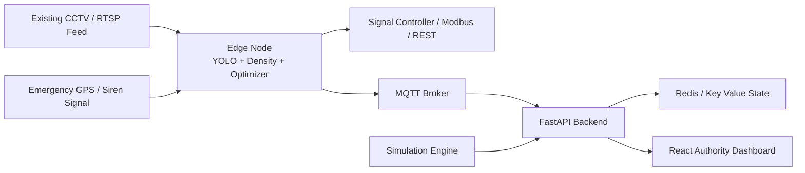

# UrbanMind

UrbanMind is an AI-powered smart traffic management system for Indian cities. It
combines edge computer vision, adaptive signal optimisation, emergency corridor
pre-emption, and a live authority dashboard into one deployable platform.

Built for `India Innovates 2026` by `Group M1`:

- Anurag Singh
- Prakhar Gupta
- Yashraj Kumar
- Rungta University, Bhilai, Chhattisgarh

## Vision

UrbanMind is designed to convert every traffic signal into a real-time AI
decision node using existing CCTV infrastructure instead of expensive new road
hardware.

Core goals from the project presentation and implementation:

- reduce congestion caused by fixed-timer signals
- accelerate ambulance and emergency vehicle movement through green corridors
- give city authorities live visibility into intersection state and traffic load
- provide a scalable, infra-light control layer for Indian urban roads

## Problem

Indian urban traffic systems still rely heavily on static signal timings and
manual monitoring. That creates four recurring failures:

- signals ignore real-time density and keep low-traffic and high-traffic lanes on the same schedule
- ambulances and fire vehicles lose critical time waiting at intersections
- traffic control teams lack live intersection-level telemetry
- idling and stop-go behaviour increase fuel waste and emissions

## Solution Overview

UrbanMind addresses this with four connected subsystems:

1. `Computer vision at the edge`
   RTSP/CCTV feeds are processed near the intersection to estimate queue length,
   density, vehicle mix, and emergency activity.
2. `Adaptive signal timing`
   Lane pressure and flow data are translated into updated cycle timings using
   the optimisation logic in the edge and prototype packages.
3. `Emergency green corridor control`
   GPS and siren-aware pre-emption logic reserves green phases along an
   emergency route and restores normal operation after passage.
4. `Live authority dashboard`
   A React dashboard shows intersection state, KPIs, and active emergency
   corridors through REST and WebSocket feeds.

## Architecture



## Repository Structure

This repository contains both the full UrbanMind platform and a standalone
traffic optimisation prototype package.

### Main platform

- `urbanmind/edge/`
  Edge runtime for RTSP ingestion, vehicle detection, density scoring, signal
  control, corridor handling, and MQTT publishing.
- `urbanmind/backend/`
  FastAPI control plane with Redis-backed state, emergency APIs, manual signal
  overrides, and live telemetry streaming.
- `urbanmind/frontend/`
  Vite + React dashboard for live intersection monitoring and emergency control.
- `urbanmind/simulation/`
  Multi-intersection simulation that can post generated state into the backend.
- `urbanmind/ml/`
  Training and evaluation scripts for YOLO and siren models.
- `urbanmind/tests/`
  Test suite for corridor, density, and optimisation logic.

### Prototype package

- `src/traffic_ai/`
  Core Python prototype for traffic analysis, adaptive timing, emergency
  corridor orchestration, and a lightweight HTTP API.
- `tests/`
  Unit tests for the prototype package.

## Technology Stack

- `Computer Vision`: YOLOv8, OpenCV, RTSP-based video ingest
- `Backend`: FastAPI, Redis, MQTT
- `Frontend`: React, Vite, Tailwind CSS, Recharts, Leaflet
- `Simulation`: Python multi-intersection simulator
- `Edge / Hardware Integration`: Jetson Nano or Raspberry Pi-class edge devices,
  controller adapters, siren detection, GPS-assisted corridor logic

## Key Features

- adaptive signal timing driven by live lane conditions
- live dashboard with per-intersection telemetry and emergency status
- emergency vehicle corridor pre-emption across multiple intersections
- MQTT-based edge-to-backend state transport
- Redis-backed backend state with live WebSocket updates
- simulation mode for testing without live hardware
- fallback-friendly architecture for development and fixed-timer reversion

## Quick Start

### Full local stack

```bash
cd urbanmind
python3.11 -m venv .venv
source .venv/bin/activate
pip install -r backend/requirements.txt -r edge/requirements.txt pytest rich
docker compose up -d redis mqtt
./run_all.sh
```

If `python3.11` is not your default interpreter:

```bash
cd urbanmind
PYTHON_BIN=$(command -v python3.11) ./run_all.sh
```

The launcher starts:

- FastAPI backend on `http://localhost:8000`
- React frontend on `http://localhost:3000`
- simulation workers posting live state into the backend

### Individual services

Backend:

```bash
cd urbanmind
python3 -m uvicorn backend.main:app --host 0.0.0.0 --port 8000
```

Frontend:

```bash
cd urbanmind/frontend
npm install
npm run dev
```

Simulation:

```bash
cd urbanmind
python3 simulation/run_sim.py --intersections 3 --duration 300 --inject-emergency 120
```

Prototype package demo:

```bash
PYTHONPATH=src python -m traffic_ai.demo
```

Prototype package API:

```bash
PYTHONPATH=src python -m traffic_ai.api
```

## Backend API Surface

Important routes in the FastAPI backend:

- `GET /health`
- `GET /intersections`
- `GET /intersections/{intersection_id}`
- `GET /intersections/{intersection_id}/history`
- `POST /intersections/{intersection_id}/state`
- `POST /signals/{intersection_id}/override`
- `DELETE /signals/{intersection_id}/override`
- `POST /emergency/activate`
- `POST /emergency/update/{vehicle_id}`
- `POST /emergency/deactivate/{vehicle_id}`
- `GET /emergency/active`
- `WS /ws/live`

## Deployment

The repo already contains deployment configs for both Render and Vercel:

- `render.yaml`
- `urbanmind/vercel.json`
- `urbanmind/frontend/vercel.json`

Recommended deployment paths:

1. `Frontend on Vercel + Backend on Render`
   Best split when you want the existing backend WebSocket behaviour.
2. `Frontend and Backend on Render`
   Simplest full-stack deployment for the current architecture.
3. `Frontend and Backend on Vercel`
   Supported in polling mode for the dashboard.

Related env templates:

- `urbanmind/backend/.env.example`
- `urbanmind/frontend/.env.example`
- `urbanmind/.env.example`

## Why This Repo Has Two Code Paths

The repository contains:

- the `UrbanMind` full-stack platform under `urbanmind/`
- the original `traffic_ai` prototype package under `src/traffic_ai/`

That structure is intentional. The prototype package isolates the optimisation
and emergency logic in a simple Python module, while `urbanmind/` layers on the
edge runtime, dashboard, simulation, and deployment setup used for the larger
project pitch and demo.

## Team

- Team name: `Group M1`
- Project: `UrbanMind - Dynamic AI Traffic Flow Optimizer & Emergency Grid`
- Institution: `Rungta University, Bhilai, Chhattisgarh`

---

Designed and Developed By Anurag Singh
