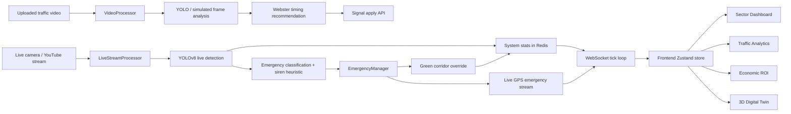

# UrbanMind Hackathon Tech Report

## 1. Project Snapshot

**Project Name:** UrbanMind  
**Theme:** AI-driven urban mobility, adaptive traffic management, emergency response optimization, and city-scale digital twin visualization

UrbanMind is a real-time intelligent traffic orchestration platform built for metropolitan road networks. It combines live vision telemetry, adaptive signal optimization, emergency green-corridor automation, manual video analysis, and a 3D digital twin into one operator-facing command interface.

The current implementation is configured around **9 Delhi-sector intersections**, seeded in the backend and visualized across the dashboard, analytics, ROI, emergency operations, live footage, and digital twin experiences.

## 2. Problem Statement

Urban traffic systems still suffer from three major structural problems:

1. Fixed-signal timing wastes throughput during changing traffic conditions.
2. Emergency vehicles lose critical time at intersections because corridor coordination is delayed or manual.
3. City operators lack one unified control plane that blends live traffic, computer vision, emergency routing, operational analytics, and spatial simulation.

UrbanMind addresses these issues by turning fragmented traffic telemetry into an integrated, decision-ready command system.

## 3. Solution Overview

UrbanMind delivers five connected capabilities:

1. **Real-time sector dashboard**
   Shows synced network KPIs, live traffic footage, AI recommendations, sector deployment state, and administrative alerts.
2. **Live vision intelligence**
   Runs YOLO-backed detection on a live video source, keeps a rolling total of detected vehicles, projects counts between ground-truth refreshes, and publishes the results across the system.
3. **Emergency operations**
   Detects probable ambulance, police, or fire vehicles, verifies siren-like visual signatures, and auto-activates green corridors with live GPS route playback.
4. **Manual vision analysis**
   Accepts uploaded videos, analyzes sampled frames with YOLO, computes directional counts, lane density, and recommended Webster timings, then allows those timings to be applied.
5. **Digital twin + business impact**
   Projects the traffic state into a 3D city view while also quantifying ROI, emissions savings, time recovered, and civic operations value.

## 4. Demo Scope in This Repo

The seeded network contains these 9 sectors:

1. Connaught Place (CP) Outer Circle
2. ITO Junction (Vikas Marg)
3. AIIMS Crossing (Ring Road)
4. Hauz Khas Junction (August Kranti)
5. Lajpat Nagar (Moolchand Crossing)
6. Nehru Place Main Intersection
7. Karol Bagh (Pusa Road)
8. Dwarka Sector 10 Chowk
9. Rohini Sector 15 Crossing

These sectors are defined in [`backend/scripts_seed.py`](../backend/scripts_seed.py) and seeded into Redis-backed state.

## 5. Product Experience Map

### Frontend Pages

- **Sector Dashboard**: operational command view with AI Core Engine, live footage, sector deployment, and administrative log
- **All Footages**: 9 camera nodes with live sources
- **Traffic Analytics**: charts and network summaries
- **Emergency Ops**: corridor view, map, and emergency controls
- **Economic ROI**: savings, efficiency, and impact analytics
- **Manual Vision**: uploaded-video analysis workflow
- **3D City Digital Twin**: spatial view of the network
- **Settings**: system metadata and credits

### Operator Journey

1. Dashboard connects to the websocket feed.
2. Intersections and system stats hydrate into the frontend store.
3. Live YOLO telemetry updates total vehicles, wait, efficiency, and status in real time.
4. If an emergency vehicle or siren-like profile is detected, Emergency Ops is auto-triggered.
5. Administrative Log records the event with its trigger source.
6. Analytics and ROI pages reflect the same synced metrics.
7. Digital Twin visualizes those conditions as a spatial simulation layer.

## 6. End-to-End Architecture



## 7. Realtime Working Pipeline

### 7.1 Startup Lifecycle

The backend startup sequence in [`backend/main.py`](../backend/main.py) is:

1. Connect to Redis via `state_manager`
2. Start the live vision processor
3. Attempt MQTT connection
4. Bind websocket broadcast callbacks into the routers
5. Start the websocket tick loop
6. Start the Webster optimization loop
7. Start the traffic simulator in demo mode
8. Expose uploads and API routes

This startup ordering matters because the app depends on Redis-backed state, then live telemetry, then broadcast loops.

### 7.2 Realtime Data Plane

The realtime system is built around three continuously changing layers:

- **Intersection state**
  Stored in Redis hashes, one per intersection.
- **System stats**
  Stored in `system:stats`, containing live totals, countdowns, uptime, vision status, siren status, and emergency metadata.
- **Websocket broadcast**
  Streams the current network state to the frontend every 500 ms.

`backend/routers/ws.py` assembles a unified payload containing:

- `total_vehicles`
- `vision_total_vehicles_detected`
- `network_avg_wait`
- `webster_countdown`
- `active_emergencies`
- `emissions_saved_pct`
- `uptime_seconds`
- `webster_recalculations`
- `last_detection_count`
- `live_vision_status`
- siren detection fields

The frontend consumes this in [`frontend/src/hooks/useWebSocket.ts`](../frontend/src/hooks/useWebSocket.ts), normalizes it through [`frontend/src/lib/store.ts`](../frontend/src/lib/store.ts), derives computed KPIs through [`frontend/src/lib/traffic-metrics.ts`](../frontend/src/lib/traffic-metrics.ts), and fans the same state into every major page.

## 8. Live Vision Pipeline

### 8.1 Source

The live vision processor is implemented in [`backend/services/live_processor.py`](../backend/services/live_processor.py). It currently uses a YouTube traffic feed as the source and downloads a thumbnail via `yt-dlp` for repeated, lightweight inference.

### 8.2 Detection Strategy

UrbanMind uses a hybrid approach:

1. Run periodic **YOLO ground truth** on a fresh frame
2. Store the detected vehicle count
3. Between YOLO refreshes, project short-interval movement to keep the dashboard feeling live
4. Maintain a cumulative `vision_total_vehicles_detected`
5. Push updated system stats back into Redis

This design is a practical hackathon tradeoff: it preserves AI-backed detections while staying responsive and lightweight.

### 8.3 Emergency Classification

The live processor also checks each YOLO result for:

- direct emergency labels if the model provides them
- heuristic ambulance patterns
- heuristic police patterns
- heuristic fire vehicle patterns
- siren-like visual signatures based on red/blue light-bar style color ratios

If confidence is high enough, the processor can auto-sync Emergency Ops through `EmergencyManager`.

### 8.4 Why This Matters for a Pitch

This is not just a dashboard counter. The vision model actively changes operations:

- updates total vehicle telemetry
- updates sector KPIs
- influences AI recommendations
- triggers emergency workflows
- creates admin log events
- feeds downstream analytics and ROI estimates

## 9. Manual Vision Pipeline

### 9.1 Upload Flow

The manual analysis workflow is implemented through [`backend/routers/video.py`](../backend/routers/video.py) and [`backend/services/video_processor.py`](../backend/services/video_processor.py).

### 9.2 Processing Steps

1. Operator uploads a video
2. Backend validates extension and file size
3. File is stored under `backend/uploads`
4. A background task starts `video_processor.analyze_video(...)`
5. The processor samples frames, runs YOLO or a fallback simulated mode
6. Vehicles are classified and assigned to directional lanes
7. EW and NS counts are aggregated
8. Webster’s formula computes recommended signal timings
9. Annotated frames and summary metrics are stored in memory
10. Results can be polled and optionally applied to intersections

### 9.3 Outputs

Manual analysis returns:

- detected vehicle counts
- lane density
- annotated frames
- recommended `ew_green`, `ns_green`, and `cycle_length`
- processing status and progress

This module is useful for forensic analysis, offline audits, and scenario testing when a live feed is not available.

## 10. Adaptive Signal Optimization Pipeline

The optimization engine combines:

- live density and wait metrics from the simulator / state
- manual analysis outputs
- periodic recalculation through Webster logic

The Webster loop is launched at startup and increments the `webster_recalculations` stat that appears across the frontend.

Signal APIs in [`backend/routers/signals.py`](../backend/routers/signals.py) support:

- reading all intersections
- reading one intersection
- manual overrides
- toggling EW/NS direction

This makes UrbanMind both autonomous and operator-steerable.

## 11. Emergency Corridor Pipeline

### 11.1 Trigger Modes

Emergency activation can happen in three ways:

1. Manual dispatch from the emergency API
2. Vision-triggered auto dispatch
3. Siren-verified vision dispatch

### 11.2 Emergency Manager Behavior

[`backend/services/emergency_manager.py`](../backend/services/emergency_manager.py) handles:

- route selection for ambulance, fire, and police
- realistic Delhi GPS tracks
- intersection corridor selection
- signal override activation
- GPS streaming
- progressive corridor clearing as vehicles move through intersections
- emergency history tracking

### 11.3 Frontend Sync

The frontend websocket hook:

- adds emergency vehicles to the store
- updates live positions
- shows corridor messages
- writes trigger-aware notifications into the Administrative Log

This is one of the strongest hackathon demo moments because the AI detection path leads directly to operational action.

## 12. Digital Twin Workflow

The Digital Twin page in [`frontend/src/pages/DigitalTwin.tsx`](../frontend/src/pages/DigitalTwin.tsx) visualizes the same live network state used everywhere else.

### Current flow

1. The page pulls intersections and system stats from the shared Zustand store
2. `deriveTrafficMetrics(...)` computes network-level values
3. Hotspot intersections are ranked by delay and density
4. The 3D city embed is rendered through [`frontend/src/components/City3D/City3D.tsx`](../frontend/src/components/City3D/City3D.tsx)
5. The side rail shows hotspot priority and selected-sector details

### Why it matters

The Digital Twin is not an isolated visual. It is a spatial presentation layer over the same operational telemetry that drives:

- the main dashboard
- analytics
- emergency routing
- ROI calculations

For hackathon pitching, this helps translate numbers into city-level situational awareness.

## 13. Frontend Architecture

### Core stack

- React 18
- TypeScript
- Vite
- Tailwind CSS
- Zustand
- Recharts
- React Router
- Lucide icons
- Leaflet / React-Leaflet
- Three.js dependency set

### State flow

The frontend follows a simple but effective pattern:

1. `useWebSocket()` receives init/tick/event messages
2. `useTrafficStore` stores normalized intersections and system metrics
3. shared metric derivation happens in `traffic-metrics.ts`
4. pages read from the same store instead of recomputing from disconnected sources

This shared-state design is why the dashboard, ROI page, analytics, and Digital Twin can stay synchronized.

### Major frontend modules

- `components/dashboard/*`: command center widgets
- `components/analytics/*`: traffic charts and drilldowns
- `components/emergency/*`: corridor and emergency UI
- `components/map/*`: map rendering
- `components/City3D/*`: digital twin rendering layer
- `components/layout/*`: app shell and responsive navigation
- `pages/*`: route-level application views

## 14. Backend Architecture

### Core stack

- FastAPI
- Uvicorn
- Redis
- Paho MQTT
- OpenCV
- Ultralytics YOLOv8
- NumPy
- Pydantic v2
- Async Python services

### Service responsibilities

- `state_manager.py`
  Central state abstraction over Redis
- `live_processor.py`
  Live vision detection, cumulative counts, emergency heuristics, siren module
- `video_processor.py`
  Uploaded video analysis and recommendation engine
- `emergency_manager.py`
  Route simulation, corridor control, GPS streaming
- `simulator.py`
  Demo traffic evolution
- `webster.py`
  Timing optimization logic
- `mqtt_client.py`
  External signal-network messaging hook

### API surface

- `/health`
- `/api/v1/demo/reset`
- `/api/v1/signals/*`
- `/api/v1/emergency/*`
- `/api/v1/video/*`
- `/api/v1/analytics/*`
- `/ws/dashboard`

## 15. Data Model and Persistence

### Redis usage

Redis is the operational state backbone for the demo:

- `int:<id>` stores each intersection
- `ints:all` stores the intersection index
- `int:<id>:wait_history` stores recent wait history
- `system:stats` stores live global metrics
- `emergency:events` stores recent emergency history

### Why Redis fits here

- fast realtime reads and writes
- simple key-based state for live demos
- easy websocket integration
- supports future horizontal event processing

## 16. Tech Stack Table

| Layer | Technology | Purpose |
|---|---|---|
| Frontend | React 18 + TypeScript | Operator UI |
| Build tooling | Vite | Fast local development and production build |
| Styling | Tailwind CSS | Responsive UI system |
| Client state | Zustand | Shared realtime app state |
| Charts | Recharts | Analytics and ROI visualizations |
| Mapping | Leaflet / React-Leaflet | Emergency and geographic views |
| 3D visualization | Sketchfab embed + Three.js dependency set | Digital twin experience |
| Backend API | FastAPI | Realtime and REST APIs |
| Async server | Uvicorn | ASGI serving |
| Realtime transport | WebSocket | 500 ms network updates |
| AI vision | Ultralytics YOLOv8n | Vehicle detection |
| CV runtime | OpenCV | Frame loading and processing |
| State store | Redis | Intersection and system state |
| Messaging hook | MQTT | Signal-network integration path |
| Validation | Pydantic | Typed request/response models |
| Containerization | Docker Compose | Multi-service local deployment |

## 17. Competitive Pitch Angles

### Why UrbanMind stands out

1. **Closed-loop AI system**
   Detection does not stop at analytics; it drives emergency corridor activation and synced operational UI changes.
2. **Full-stack demo readiness**
   The project includes a frontend command center, backend APIs, live websocket state, Redis persistence, and AI inference.
3. **Multi-modal traffic intelligence**
   Supports both live feeds and uploaded videos.
4. **Spatial storytelling**
   The digital twin makes the system easier to pitch to judges and non-technical stakeholders.
5. **Business + civic framing**
   ROI, emissions, time savings, and emergency response are all represented.

## 18. Hackathon Demo Script

### Suggested 4-6 minute flow

1. Open the Sector Dashboard and explain the 9 live sectors.
2. Show the live vehicle count, efficiency, and administrative alerts changing in real time.
3. Move to All Footages and show the multi-node network.
4. Trigger or explain emergency auto-detection and show the corridor activation flow.
5. Open Traffic Analytics to show that the same state powers charts and summaries.
6. Open Economic ROI to frame time savings, cost savings, and emissions reduction.
7. End on the 3D Digital Twin to show city-scale situational awareness.

### One-line pitch

UrbanMind is an AI-powered urban traffic command platform that detects traffic conditions in real time, optimizes signal timing, auto-prioritizes emergency vehicles, and visualizes the entire network as a live digital twin.

## 19. Deployment Shape

The repository already includes a `docker-compose.yml` with:

- `api`
- `redis`
- `mqtt`
- `frontend`

That makes the project straightforward to package for:

- local demo setups
- judging stations
- campus innovation showcases
- future cloud deployment with managed Redis and container hosting

## 20. Limitations and Honest Framing

For a strong hackathon pitch, these should be explained clearly:

1. The live vision path currently uses a thumbnail-based YOLO refresh with short-interval projection, which is a performance-conscious demo design rather than full-frame streaming inference.
2. Emergency vehicle classification is partly heuristic unless a dedicated emergency-vehicle model is introduced.
3. The Digital Twin currently uses an embedded 3D city visualization rather than a fully procedural road-network simulator.
4. MQTT support exists, but local demos may run without an active broker.

These do not weaken the project if framed correctly. They show a working MVP with a clear roadmap.

## 21. Roadmap

### Near-term

- replace heuristic emergency detection with a domain-tuned model
- add true audio-based siren detection alongside visual siren cues
- connect real CCTV / RTSP feeds
- persist historical analytics in a database
- add operator roles and audit logs

### Mid-term

- corridor routing based on live map traffic
- reinforcement-learning signal control experiments
- city-level what-if simulation inside the digital twin
- incident prediction and preventive rerouting

## 22. Codebase Map

```text
UrbanMind/
├── backend/
│   ├── main.py
│   ├── config.py
│   ├── routers/
│   │   ├── analytics.py
│   │   ├── emergency.py
│   │   ├── signals.py
│   │   ├── video.py
│   │   └── ws.py
│   ├── services/
│   │   ├── emergency_manager.py
│   │   ├── live_processor.py
│   │   ├── mqtt_client.py
│   │   ├── simulator.py
│   │   ├── state_manager.py
│   │   ├── video_processor.py
│   │   └── webster.py
│   ├── models/
│   └── scripts_seed.py
├── frontend/
│   ├── src/
│   │   ├── App.tsx
│   │   ├── hooks/useWebSocket.ts
│   │   ├── lib/store.ts
│   │   ├── lib/traffic-metrics.ts
│   │   ├── pages/
│   │   └── components/
├── docker-compose.yml
└── docs/HACKATHON_TECH_REPORT.md
```

## 23. Best Files to Show Judges or Mentors

If someone asks where the “real intelligence” lives, start with:

1. `backend/services/live_processor.py`
2. `backend/services/emergency_manager.py`
3. `backend/services/video_processor.py`
4. `backend/routers/ws.py`
5. `frontend/src/hooks/useWebSocket.ts`
6. `frontend/src/lib/store.ts`
7. `frontend/src/pages/DigitalTwin.tsx`
8. `frontend/src/pages/Overview.tsx`

## 24. Final Positioning

UrbanMind is best pitched as a **city operations intelligence platform**, not just a traffic dashboard. The most compelling story is that one AI-enabled system can:

- observe traffic
- reason about conditions
- optimize signals
- prioritize emergencies
- explain itself to operators
- quantify its civic and economic value
- visualize the city as a live digital twin

That combination gives the project both strong technical depth and strong demo appeal for a hackathon setting.
